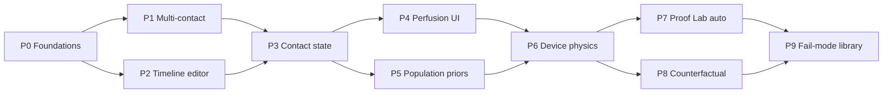

# Near-term high-leverage simulation roadmap

**Scope:** Thermal · mechanical · electrical only. No chemistry engine, no genome layer, no full 3D FE tissue.

**Goal:** Make Vide feel less like “one temperature curve” and more like a product engineers use to design contact stimuli — multi-contact, real protocols, contact physics, population risk, and automatic literature checks.

**Non-negotiables (carry over from YC demo roadmap)**

- Rust physics stays the source of truth. UI/AI assist parameters; they do not invent temperatures.
- Anatomy GLB = placement/visualization. Tissue response = site profile + contact scalars.
- Every new claim needs a citation path or an explicit “model assumption” label.
- Ship vertical slices: each phase should leave the app demoable.

**Estimated calendar:** ~8–10 weeks for one engineer (or ~5–6 weeks with two). Phases can overlap once foundations land.

---

## Current baseline (what you already have)

| Capability | Status | Where |
|------------|--------|--------|
| 1D / axisymmetric heat + damage (Ω, CEM43) | Done | `src-tauri/src/simulation/` |
| Local hyperemia perfusion model | Done | `perfusionModel`, `perfusionMaxFold` |
| Controller power limit | Done | `controllerMaxFluxWM2` |
| Timeline protocol fields (UI preview) | Partial | `protocolMode`, `HeatTimelinePreview` |
| Multi-contact heat runs | Partial | Solver accepts many contacts; weak interference story |
| Pressure / electrical modalities | Partial | Mechanics + electrical panels exist; less polished than heat |
| Proof Lab vs papers | Done (new) | Auto-runs after simulation; protocol match UX |
| Sensitivity / property bands | Partial | Catalog `low`/`high`; not first-class in Results |
| Fail-mode / Fo diagnostics | Partial | Model diagnostics exist; not a fail-mode library |

This roadmap turns those stubs into product features.

---

## North-star demo (end of roadmap)

1. Place **two** contacts (heater + strap pressure, or dual heaters).
2. Edit a **ramp → hold → pulse** waveform visually.
3. Toggle **dry / sweaty / gel** contact state; see conductance and peak basal move.
4. Open Results: **perfusion fold vs time**, power-limited controller note, **population % exceedance**.
5. Click **“Cheapest way to drop peak basal 1 °C”** — Vide proposes pad / duration / material change.
6. Proof Lab already compared the run; a **fail-mode chip** warns if the contact is too small for 1D.
7. Pitch line: *“Not a single curve — a design decision with risk, contact physics, and literature.”*

---

## Roadmap overview



| Phase | Theme | Weeks | Depends on |
|-------|--------|------:|------------|
| P0 | Shared foundations | 0.5–1 | — |
| P1 | Multi-contact interference | 1–1.5 | P0 |
| P2 | Time-history protocol editor | 1–1.5 | P0 |
| P3 | Sweat / moisture / interface state | 1 | P0 |
| P4 | Perfusion as first-class UI | 0.5–1 | P3 helpful |
| P5 | Aging / BMI / site priors | 1 | P0 |
| P6 | Wearable duty cycle + power limit | 1 | P2 |
| P7 | Proof Lab automatic productization | 0.5 | Existing Proof Lab |
| P8 | Counterfactual design assistant | 1–1.5 | P1–P3 |
| P9 | Fail-mode library | 1 | P1, P6 |

Suggested ship order if capacity is tight: **P0 → P2 → P3 → P4 → P7 → P5 → P1 → P6 → P8 → P9**.

---

## Phase 0 — Foundations (Week 0–1)

**Objective:** Shared plumbing so later phases don’t each invent sampling, series channels, and result cards.

### Build

1. **Result series registry**  
   Formalize named channels beyond temperature/Ω:
   - `surfaceTemperatureC`, `basalTemperatureC`
   - `omegaBasal`, `cem43BasalMinutes`
   - `perfusionFold` *(new)*
   - `controllerFluxWM2` *(new)*
   - `interfaceConductanceWM2K` *(new, may be constant per run)*

2. **Uncertainty / ensemble runner (API)**  
   Tauri command sketch:
   ```ts
   runEnsemble({
     contacts, assignments, settings,
     mode: "nominal" | "bounds" | "population",
     sampleCount?: number
   }) → { nominal, bands?, populationSummary? }
   ```
   - `bounds`: low/high catalog properties (existing sensitivity direction).
   - `population`: sample subject priors (P5).

3. **Results layout contract**  
   Keep verdict → charts → collapsed physics detail. New features plug into:
   - Verdict badges
   - Chart tabs
   - Collapsed “Design assistants” / “Fail modes”

4. **Feature flags**  
   `features.timelineEditor`, `features.populationMode`, etc., so incomplete work doesn’t ship mid-demo.

### Files likely touched

- `src-tauri/src/simulation/mod.rs` (result schema)
- `src/lib/simulation.ts` (TS types)
- `src/components/sidebar/ResultsPanel.tsx`
- `src/store/experimentStore.ts`

### Test

- Golden run: single heat contact still matches current nominal peak basal within tolerance.
- Ensemble `bounds` returns finite low ≤ nominal ≤ high for peak basal.

### Exit criteria

- New series keys can be added without rewriting Results.
- Ensemble API exists even if UI only shows nominal.

---

## Phase 1 — Multi-contact interference

**Objective:** Multiple stimuli on one limb are a first-class story, not N independent charts.

### Product behavior

- User places Contact A (heat) and Contact B (heat or pressure).
- Results show:
  - Per-contact verdicts (existing)
  - **Interference panel:** “B raised A’s peak basal by +0.6 °C vs A alone” (when both heat)
  - Optional combined risk: max Ω across contacts, or pressure+heat co-located warning

### Build

1. **Distance / co-location heuristic (visual + soft physics)**  
   - Use stored contact positions in anatomy-local space.
   - If distance &lt; threshold (e.g. √area scale), flag “overlapping / nearby.”
2. **Baseline isolation runs (cheap)**  
   For heat pairs marked nearby:
   - Run A alone, B alone, A+B (or reuse A+B main run + two light runs).
   - Report Δpeak and ΔΩ attributable to neighbor.
3. **Cross-modality rules (v1, non-PDE)**  
   - Pressure near heat → bump contact pressure / conductance prior; show assumption chip.
   - Electrical near heat → show nerve-threshold caution (link to electrical panel), don’t fake coupled PDE yet.
4. **UI**  
   - Multi-contact comparison strip (you have a seed of this).
   - Interference callout under verdict when Δ is material (&gt;0.3 °C or &gt;10% Ω).

### Solver honesty

- v1 may still solve contacts independently in 1D and **post-process interference**.
- Label: “Interference estimate from isolated re-runs, not a shared 3D mesh.”
- v2 (later): shared axisymmetric domain when contacts share a site — out of this roadmap’s MVP.

### Files

- `experimentStore.runSimulation`
- `ResultsPanel` / `MultiContactComparison`
- Optional `src/lib/contactInterference.ts`

### Test

- Two far contacts → interference panel hidden or “negligible.”
- Two identical overlapping heats → Δ vs alone is non-zero and stable in regression fixture.

### Exit criteria

- Demo: two nearby forearm heaters → clear “neighbor effect” sentence + numbers.

---

## Phase 2 — Time-history protocol editor

**Objective:** Replace “temperature + duration” as the only mental model with editable waveforms matching CHEPS / wearables / therapy pads.

### Product behavior

- Protocol mode: **Constant** | **Timeline**
- Timeline segments: Hold → Ramp → Pulse train → Release (reuse `timeline` Rust module)
- Live waveform preview (exists) becomes **editable**: drag duration, edit target °C, repeats
- Run uses the same timeline the preview shows

### Build

1. **Audit Rust `timeline` vs UI fields**  
   Ensure `protocolMode === "timeline"` actually drives the solver path end-to-end (today UI preview may be ahead of wiring).
2. **Segment editor UI**  
   - List of segments with type, duration, target temperature / amplitude
   - Add / remove / reorder
   - Total active time + damage note (“Ω accumulates through release”)
3. **Presets as timeline templates** (not body presets)  
   - CHEPS-style brief pulse  
   - Therapy pad 12 min hold  
   - Wearable intermittent duty cycle (ties to P6)
4. **Results**  
   - Overlay device setpoint schedule as a step line behind skin temperature

### Files

- `src-tauri/src/simulation/timeline.rs`
- `src/lib/stimuli.ts` (timeline fields)
- `StimulusForm.tsx` / new `TimelineEditor.tsx`
- `ResultsPanel` chart layer

### Test

- Timeline with ramp+hold matches analytic expectation on a homogeneous fixture (peak timing shifts with ramp).
- Constant mode ≡ single hold segment (bit-identical or within 1e-6).

### Exit criteria

- User builds a 3-segment protocol without touching advanced JSON-like fields.
- Chart shows schedule + tissue response.

---

## Phase 3 — Sweat / moisture / contact state

**Objective:** Make the interface the hero — dry vs gel vs sweat should move results as much as ±2 °C setpoint.

### Product behavior

- Primary control: **Contact state** = Dry | Light sweat | Wet / gelled | Custom interface
- Selecting a state sets:
  - `interfaceMaterialId`
  - default thickness
  - suggested `contactPressureKpa` behavior (dry = pressure-dependent; film = ignore pressure)
- Results verdict mentions contact state: “Gelled contact lowered peak basal 1.2 °C vs dry.”

### Build

1. **State → parameter map** (literature-backed defaults in one table)  
   | State | Interface | Notes |
   |-------|-----------|--------|
   | Dry | `dry-contact` | Pressure-dependent conductance |
   | Light sweat | `water-film` thin | Higher conductance |
   | Gelled | `hydrogel` | Thick, stable |
   | Tape / fabric | existing materials | Wearables |
2. **One-click compare**  
   Re-run or ensemble dry vs gelled for same setpoint; show delta chips.
3. **Sidebar simplification**  
   Contact state on essential row; raw interface material stays in Advanced.
4. **Proof Lab awareness**  
   Protocol match includes interface when paper specifies gel/dry.

### Files

- `stimuli.ts`, `StimulusForm.tsx`
- `model.rs` interface catalog (labels already simplified)
- `ResultsPanel` contact-state chip
- Optional `src/lib/contactStates.ts`

### Test

- Dry vs hydrogel at identical T, duration, area → hydrogel peak basal ≤ dry (typical).
- Pressure sweep changes dry conductance path; does not change hydrogel path.

### Exit criteria

- Non-expert can change moisture state and immediately see a trusted directional effect.

---

## Phase 4 — Perfusion as first-class UI

**Objective:** Blood flow is visible during long holds — explains plateaus and “why longer isn’t linearly worse.”

### Product behavior

- New chart tab: **Blood flow**
  - Perfusion fold vs time at basal (or dermis)
  - Optional skin temperature on twin axis
- Verdict side metric: peak perfusion fold reached
- Advanced still has static vs local-hyperemia + max fold

### Build

1. **Emit `perfusionFold` (or absolute perfusion) each timestep** from solver when hyperemia model is on.
2. **Results chart** using existing Recharts patterns.
3. **Copy**  
   - “Local heating increased blood flow to ~8× baseline by t = …, pulling heat from the basal layer.”
4. **Tie to Proof Lab**  
   Wang EPOS-style cases: optional compare of perfusion proxies if dataset supports it; otherwise educational only.

### Files

- Solver sample struct in Rust + TS `ThermalSample`
- `ResultsPanel` chart tabs
- Glossary one-liner in Results / Proof Lab

### Test

- Static perfusion → fold series constant ≈ 1.
- Hyperemia long hold → fold rises with temperature; peak basal &lt; static case for same long protocol.

### Exit criteria

- 12-minute therapy-pad demo narrates perfusion without opening Advanced.

---

## Phase 5 — Aging / BMI / site priors

**Objective:** Subject is not a single default forearm. Priors change thickness, baseline T, perfusion reactivity — always as distributions, not destiny.

### Product behavior

- Subject bar (Results or Contacts):  
  **Age band** · **BMI / body habitus** · **Site** (already from anatomy mapping)
- Applies multiplicative / additive priors to catalog properties within published ranges.
- Population mode (optional toggle): N virtual subjects → “% exceeding 44 °C basal.”

### Build

1. **Prior table v1** (cite each row)  
   Examples:
   - Older adult → thinner dermis / lower baseline perfusion reactivity
   - Higher BMI → thicker subcutaneous fat on abdomen/thigh profiles
   - Site already selects profile; priors adjust within profile bands
2. **`population` ensemble** using P0 API  
   - Sample baseline skin T, fat thickness scale, perfusion max fold
   - Summary: p50 / p90 peak basal, % with Ω_basal ≥ 0.53 / 1.0
3. **UI**  
   - Compact subject controls
   - Population summary card under verdict (hidden if N=1)

### Honesty rules

- Never claim patient-specific genomic or clinical prediction.
- Every prior shows “literature range” tooltip + confidence.

### Files

- `src/lib/subjectPriors.ts`
- Ensemble runner
- `ResultsPanel` population card
- Catalog remains source of absolute bounds

### Test

- Extreme priors stay inside catalog low/high clamps.
- Population seed is deterministic for regression.

### Exit criteria

- Demo line: “In 100 simulated older adults, 18% crossed elevated risk under this wearable duty cycle.”

---

## Phase 6 — Wearable duty cycle + battery-limited power

**Objective:** Device physics is visible. Controllers can’t deliver infinite flux; duty cycle defines exposure.

### Product behavior

- Device panel essentials:
  - Max heater flux / power density (existing `controllerMaxFluxWM2`)
  - Duty cycle % and period (ties to timeline pulse train)
  - Optional “battery pack estimate” as UX only (energy = ∫ flux · area · dt) — not a SPICE model
- Chart: **commanded setpoint vs delivered flux** when saturated
- Verdict caveat when saturated: “Controller hit power limit — skin cooler than ideal setpoint run.”

### Build

1. Confirm solver already saturates at `controllerMaxFluxWM2`; surface this in samples (`controllerFluxWM2`, `saturated: bool`).
2. Duty-cycle presets → timeline segments (on/off).
3. Results: saturation badge + energy delivered (you already show energy in places).
4. Counterfactual hook (P8): “Raise max flux” vs “lengthen duty on-time.”

### Files

- Device control path in simulation
- `stimuli.ts` device fields promotion to essential when `deviceControl !== "ideal"`
- Results chart + badge

### Test

- Ideal control vs low max-flux → lower peaks when saturated.
- Duty 50% vs 100% at same peak setpoint → lower CEM43 / Ω for 50%.

### Exit criteria

- Wearable story works without pretending the heater is an infinite reservoir.

---

## Phase 7 — Proof Lab automatic productization

**Objective:** Literature comparison is part of Run, not a forgotten tab.

### Product behavior (partially done)

- After Run → Proof Lab executes in background (`focus: false`).
- Opening Proof Lab shows fresh comparison for selected studies.
- Protocol mismatch → Match protocol CTA (done).

### Remaining build

1. **Results deep link**  
   Chip: “Proof Lab ready · 1 study mismatched” → switches bottom tab.
2. **Study selection persistence**  
   Remember last selected papers per workspace session.
3. **Auto-select sensible default**  
   If site is forearm → prefer Mayrovitz/Wang; thigh → Petrofsky when present.
4. **Status in Output terminal**  
   One line: `Proof Lab complete · Mayrovitz protocol mismatch`.
5. **Don’t steal focus from Results** (already true) — keep it.

### Files

- `experimentStore.runSimulation` / `runProofLab`
- `BottomWorkspace` / Results chip
- Optional site→study heuristic helper

### Test

- Run with heat contact → `proofLabStatus` becomes complete without tab change.
- No heat + only transfer checks selected → still completes.

### Exit criteria

- Demo never manually presses “Run comparison” unless changing paper set.

---

## Phase 8 — Counterfactual design assistant

**Objective:** Vide answers “what should I change?” not only “what happened?”

### Product behavior

- Button under verdict: **Improve design**
- Goal picker: drop peak basal by 1 °C | keep under Ω 0.53 | cut CEM43 in half
- Search cheap levers (one-at-a-time, then small joint set):
  - duration, setpoint, area, interface state, max flux, duty cycle
- Output: ranked suggestions with predicted delta + tradeoffs (“longer cool-down needed”)

### Build

1. **Lever set** — discrete grid per lever (reuse parameter sweep tool guts in `ResultsPanel`).
2. **Objective function** — configurable; default peak basal.
3. **Cost heuristic (UX)** — prefer interface/gel change over lowering therapeutic temperature when labeled “therapy.”
4. **Apply suggestion** → writes sidebar params → optional re-run.
5. **Assist optional** — Azure narrates the suggestion; physics grid remains authoritative.

### Files

- `src/lib/designCounterfactual.ts`
- Tauri or client-side sweep via existing `runSimulation` invoke
- Results “Improve design” panel

### Test

- Synthetic: high setpoint → suggestion reduces T or duration and predicted metric improves.
- Applying suggestion mutates assignment fields exactly.

### Exit criteria

- One-click path from bad verdict → concrete safer design → re-run confirms direction.

---

## Phase 9 — Fail-mode library

**Objective:** Vide warns like a senior reviewer, not only like a calculator.

### Product behavior

- Persistent **Fail modes** checklist on Results (collapsed by default if clean):
  - 1D assumption broken (Fo / small patch) — already partly diagnosed
  - Controller saturation (P6)
  - Protocol mismatch vs selected Proof Lab study (P7)
  - Overlapping contacts without interference review (P1)
  - Dry contact at tiny pressure (unrealistic conductance)
  - Post-exposure window too short for damage accrual
  - Axisymmetric recommended but forced 1D
  - Site profile low confidence from anatomy mapping

### Build

1. **`FailMode` type** — `{ id, severity, title, detail, relatedContactId?, cta? }`
2. **Detectors** run after simulation from result + assignments + proof lab status.
3. **CTA hooks** — “Switch to Auto solver,” “Open Proof Lab,” “Increase post-contact window.”
4. **Export** — include fail modes in any audit JSON you already export.

### Files

- `src/lib/failModes.ts`
- `ResultsPanel` + optional Output terminal lines
- Model diagnostics integration (avoid duplicating cards)

### Test

- Tiny area + forced 1D → Fo fail mode present.
- Happy path large pad → zero high-severity modes.

### Exit criteria

- Reviewer can skim fail modes in &lt;5 seconds and know if the run is trustworthy.

---

## Cross-cutting engineering standards

### Performance budgets

| Path | Budget |
|------|--------|
| Nominal single contact | Keep current feel (sub-second–few seconds on laptop) |
| Bounds ensemble (2×) | &lt; 2× nominal |
| Population N=50 | Async with progress; don’t block Results paint |
| Counterfactual grid ≤ 20 runs | Progress UI; cancelable |

### UI patterns

- Same Results hierarchy: Verdict → Charts → Detail.
- New science gets a **badge + one sentence**, numbers in collapsed detail.
- Always label approximations (“independent 1D contacts,” “prior from literature range”).

### Validation

- Each phase adds ≥1 Rust unit test and ≥1 fixture or UI-level golden path.
- Proof Lab / literature cases stay comparison-only; don’t calibrate silently in these phases.

### Explicitly out of scope (still)

- Chemistry / PK / genome engines  
- Full 3D soft-tissue FE  
- Replacing Pennes with a learned surrogate as source of truth  

---

## Milestone checklist (ship gates)

### M1 — “Protocol & contact feel real” (≈ Week 3)

- [ ] P0 ensemble API  
- [ ] P2 timeline editor wired to solver  
- [ ] P3 contact state primary control  
- [ ] P4 perfusion chart  

### M2 — “Risk & literature” (≈ Week 5–6)

- [ ] P5 population summary  
- [ ] P7 Proof Lab chips + site-aware defaults  
- [ ] P6 saturation / duty cycle visible  

### M3 — “Design partner” (≈ Week 8–10)

- [ ] P1 interference story  
- [ ] P8 counterfactual assistant  
- [ ] P9 fail-mode library  

---

## Suggested first sprint (concrete tickets)

1. **Audit timeline path** — confirm `protocolMode` affects Rust solve; fix gaps.  
2. **Add `perfusionFold` to thermal samples** + Results chart tab.  
3. **Introduce `contactState` preset map** (dry/sweat/gel) on StimulusForm essentials.  
4. **Results chip** linking to Proof Lab status after background run.  
5. **Sketch `runEnsemble` command** with bounds-only implementation.

---

## Success metrics

| Metric | Target |
|--------|--------|
| Time to tell a wearable duty-cycle story | &lt; 2 minutes in UI |
| User understands why a long hold plateaus | Can point at perfusion chart |
| Dry vs gel delta | Visible without opening Advanced |
| Runs with silent invalid assumptions | Down — fail modes catch Fo / saturation / protocol mismatch |
| “Feels basic” feedback | Replaced by “shows risk and design options” |

---

**Last updated:** 2026-07-26  
**Companion docs:** `docs/YC_DEMO_ROADMAP.md` (physics + validation spine), `docs/CHEMICAL_TRANSPORT_FOUNDATION.md` (explicitly deferred chemistry track)
