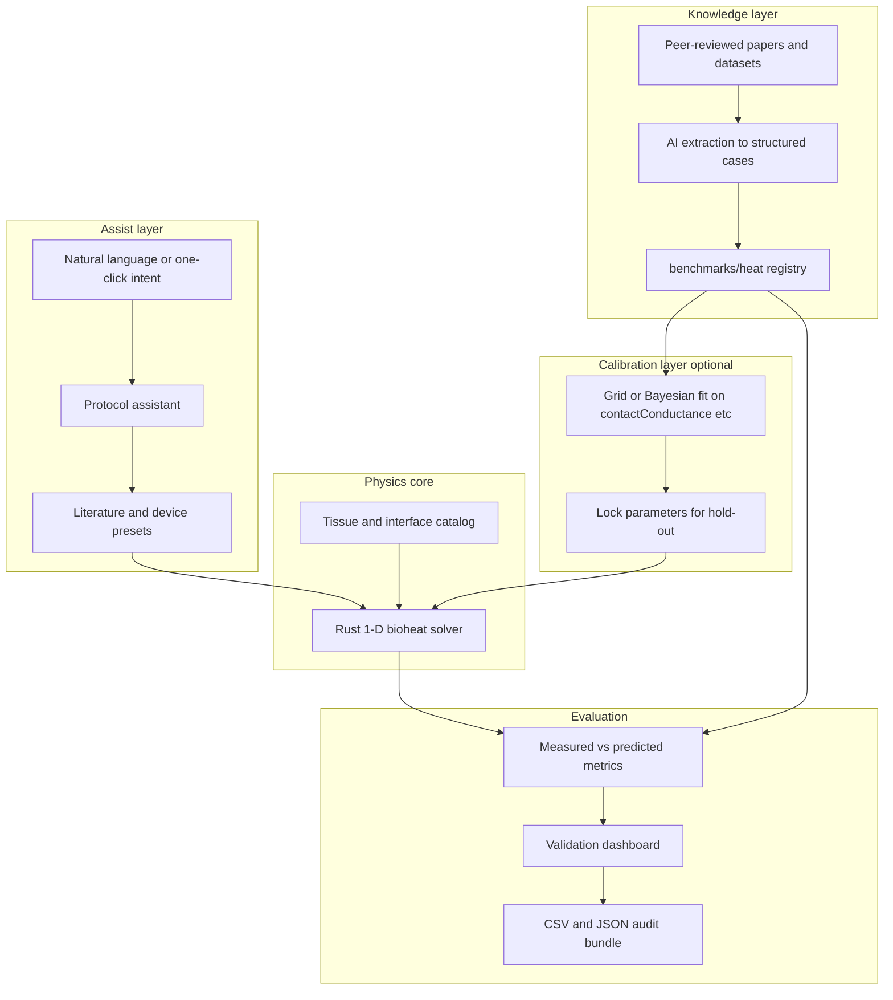

# Vide YC demo roadmap — physics-first simulation with AI assist

**Goal:** A credible demo where users place a stimulus on the body, run a **coded physics** simulation, and see **measured-vs-predicted** comparison against published forearm contact-heating data — with **uncertainty bands**, not a black-box “AI said so.”

**Non-negotiables**

- The **solver stays Pennes bioheat + finite contact conductance** (Rust). AI does not replace the PDE.
- **Validation is comparison-only** until held-out contact-site series pass predeclared thresholds.
- **Raw tabular data only** for experimental curves (no figure digitization).
- **Calibration / hold-out split** — fit only predeclared knobs on calibration; never fit hold-out.
- **GLB anatomy = placement/visualization**; tissue response = 1-D site profile at the clicked patch.

---

## Architecture (target)



---

## Phase 0 — Foundation ✅ (current)

| Item | Status | Location |
|------|--------|----------|
| 1-D heat solver + verification | Done | `src-tauri/src/simulation/` |
| Body placement + stimulus planes | Done | `ArmModel`, `BodyStimulusPlanes` |
| Validation case manifests | Done | `benchmarks/heat/cases/` |
| Source audit (no fake validation) | Done | `benchmarks/heat/SOURCE_AUDIT.md` |
| Validation dashboard + exports | Done | `ValidationDashboard`, `exportValidationReport` |
| Literature protocol apply (UI) | Done | `literatureCases.ts`, StimulusForm |

**Exit criteria:** Run heat on body → dashboard opens → literature protocols listed with honest “awaiting measured series” where applicable.

---

## Phase 1 — Knowledge curation (Week 1)

**Objective:** Turn papers into **machine-readable, citable cases** the solver and dashboard can consume without manual re-entry.

### Build

1. **Case schema v1** — extend manifests with:
   - `measurementTarget`, `thermodeProgram` (constant / ramp-hold / measured T(t) file)
   - `provenance.checksum`, `extractedBy`, `humanVerified`
2. **Registry index** — `benchmarks/heat/registry.json` lists all cases, split, availability.
3. **Ingest script** (Python or Rust CLI):
   - Validate CSV (monotonic time, units, column names)
   - Compute checksum, attach to manifest
   - Refuse ingest if measurement target ≠ simulated quantity
4. **Paper extraction pipeline** (AI assist, human verify):
   - Input: PDF or DOI
   - Output: draft manifest JSON + missing-field checklist
   - Human approves before merge

### Train

- **Not ML training** — this is **structured extraction** (LLM + schema validation).
- Fine-tune optional later on “protocol → JSON” pairs from 10–20 curated papers.

### Test

- Unit tests: CSV parser, schema validation, checksum stability.
- Golden files: `fixtures/synthetic-*.csv` must always parse.

### Integrate

- Rust validation module loads registry + optional external CSV paths.
- UI: “Literature protocol” dropdown (already wired) reads same registry.

**Exit criteria:** ≥1 case with `availability: ready` and contact-site `skin_surface` T(t) CSV checked in.

**Blocker to resolve:** Acquire PMED supplementary contact-site data **or** a second open dataset with skin T(t) under probe (see SOURCE_AUDIT).

---

## Phase 2 — Protocol assistant (Week 1–2) 🚧 in progress

**Objective:** Remove manual parameter hunting; map **intent → locked protocol**.

### Build

1. **`assist/` Rust module** — Azure Foundry client + rules fallback ✅
2. **Tauri commands** — `assist_status`, `assist_suggest_protocol`, `assist_extract_protocol` ✅
3. **UI badge** — Azure vs rules-only in StimulusForm ✅
4. **Paper extraction** — `assist_extract_protocol` (Azure required) ✅
5. **Next:** CSV ingest CLI, link workspace run to validation case id

### Train

- Collect 20–30 example utterances → expected manifest fields (for eval, not for replacing physics).
- If using LLM: system prompt + JSON schema; **never** let model output solver code or replace conductance without calibration flag.

### Test

- Unit tests: utterance → case id mapping
- Regression: applying literature case matches benchmark JSON parameters exactly

### Integrate

- Applied protocol flows into `runSimulation` → validation dashboard compares **same case id**.

**Exit criteria:** Demo script: render body → place plane → one click “PMED protocol” → run → dashboard shows matching case card.

---

## Phase 3 — Calibration layer (Week 2)

**Objective:** Close the gap between literature and model with **few fitted knobs**, not a full neural surrogate.

### Build

1. **Predeclared calibratable parameters only:**
   - `contactConductanceWM2K` (primary)
   - Optional: interface thickness within tabulated range
2. **Calibration runner** (extend `validation.rs`):
   - Grid search or bounded 1-D optimizer on **calibration split only**
   - Persist `locked_parameters.json` with source case id + RMSE at fit
3. **Hold-out evaluation:** apply locked params; **no refit**
4. **Uncertainty:** run solver at property low/high from catalog → band on peak basal / surface

### Train

- Optional **correction model**: small MLP or GP that maps `(protocol features) → Δconductance` trained **only** on calibration cases; applied as offset to physics BC, not as temperature output.
- Requires ≥3 calibration cases with measured series — defer until data exists.

### Test

- Synthetic fixtures: calibrate on `synthetic-calibration`, hold-out RMSE on `synthetic-holdout`
- Assert hold-out fit attempt returns error

### Integrate

- Dashboard shows “Calibrated: Yes” + locked conductance + calibration RMSE
- Export manifest includes lock file

**Exit criteria:** Synthetic suite shows calibrated < uncalibrated hold-out RMSE.

---

## Phase 4 — Validation & demo narrative (Week 2–3)

**Objective:** YC-ready story: **verify → compare → uncertainty**.

### Build

1. **One hero benchmark** with real measured overlay (once data acquired)
2. **Demo mode** toggle: hides synthetic fixtures, shows only literature + hero case
3. **Results copy:** sidebar unchanged; dashboard tells the validation story
4. **Recording script** (30–60 s):
   - Show body, place stimulus, apply PMED protocol
   - Run simulation, open validation dashboard
   - Show predicted curve + (when available) measured overlay + metrics
   - Show uncertainty band from sensitivity

### Test

- Rehearse full path on clean machine (`npm run tauri dev`)
- Export validation report; verify reproducibility from JSON

### Integrate

- README + pitch deck align with “physics core + validated against literature”

**Exit criteria:** Live demo completes without manual number entry; at least one chart with measured vs predicted OR explicit honest blocker with path to data.

---

## Phase 5 — Post-YC (optional)

| Track | Description |
|-------|-------------|
| **Axisymmetric patch** | 2-D r–z bioheat at clicked body location |
| **PINN / surrogate** | Fast approximate solver trained **on physics outputs**, not papers alone |
| **Population variance** | Age/site/perfusion profiles from literature ranges |
| **Pressure/mechanical** | Same knowledge + validation pattern for indentation |

---

## What we are NOT doing for YC

- End-to-end neural net replacing the heat equation
- Claiming “validated” without held-out contact-site data
- Using wrist/off-site temperature as skin-under-probe ground truth
- Digitizing figures from PDFs as primary evidence

---

## Immediate next actions (execution order)

1. **Data:** Download PMED; inspect for contact-site skin channels; update SOURCE_AUDIT + manifest if found.
2. **If no skin channel:** Email authors / find one open forearm T(t) paper with supplementary CSV.
3. **Ingest:** Drop CSV beside manifest; set `availability: ready`; re-run validation suite.
4. **Demo polish:** Literature one-click in Contacts + rehearsed script.
5. **Calibration:** Enable conductance lock once calibration case is `ready`.

---

## Commands

```bash
# Frontend
npm run build
npm run tauri dev

# Rust tests (validation + solver)
cd src-tauri && cargo test

# Validation-only tests
cd src-tauri && cargo test validation
```

---

## Ownership map

| Component | Owner file(s) |
|-----------|----------------|
| Physics solver | `src-tauri/src/simulation/mod.rs`, `solver.rs` |
| Validation / metrics | `src-tauri/src/simulation/validation.rs` |
| Case data | `benchmarks/heat/` |
| Protocol assistant | `src/lib/protocolAssistant.ts`, `literatureCases.ts` |
| UI dashboard | `src/components/validation/ValidationDashboard.tsx` |
| Store wiring | `src/store/experimentStore.ts` |

**Last updated:** 2026-07-26
